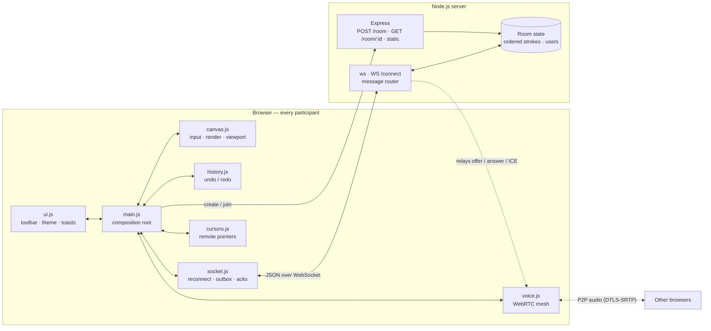
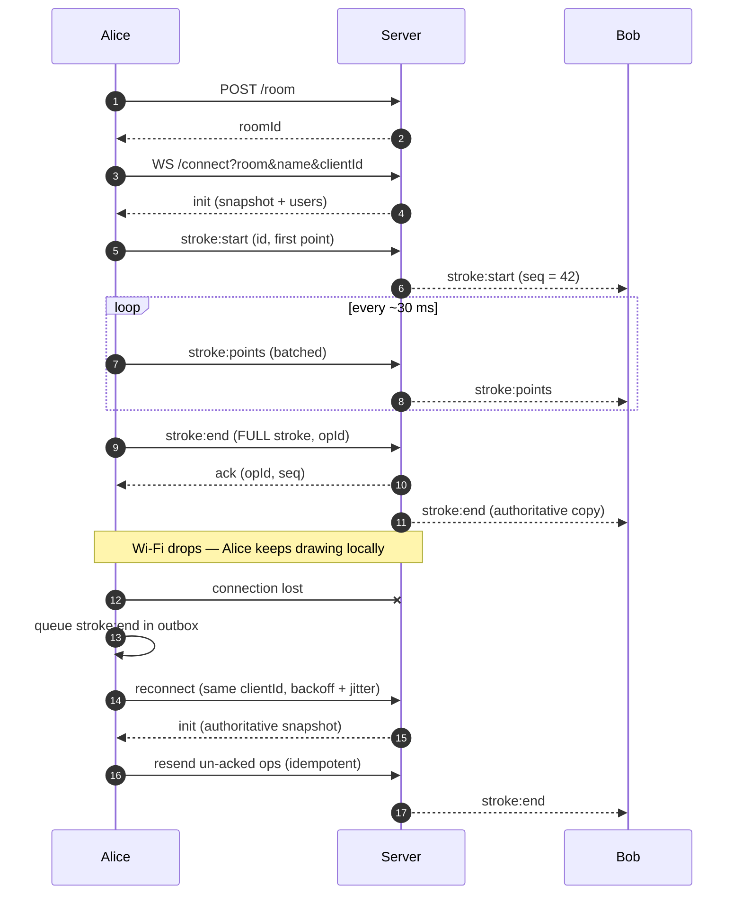
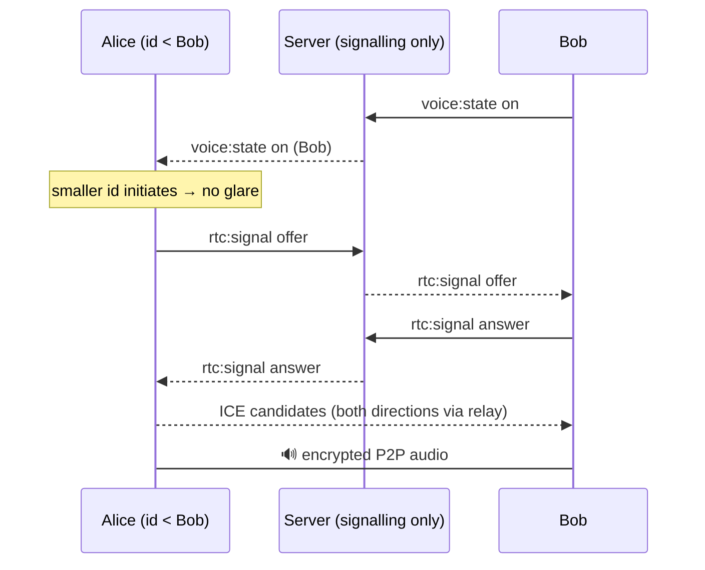

# ✦ LiveCollab

**A real-time collaborative whiteboard with live cursors, built-in voice chat and lossless reconnects.**
Open a room, share a 6-letter code, and think together on an infinite canvas — no sign-up, no install.

> Built for a 24-hour hackathon: Node.js · Express · `ws` · HTML5 Canvas · WebRTC · Tailwind CSS.

## Features

| | |
|---|---|
| 🎨 **Infinite canvas** | Smooth quadratic-curve ink, pan, pinch/ctrl-wheel zoom, themed dot grid |
| 🖍 **Tools** | Pen, eraser, 9 swatches + custom colour, brush size 1–60 |
| 👥 **Live cursors** | Everyone's pointer with their name tag, in world coordinates (stays correct while panning/zooming) |
| ↩️ **Undo / Redo** | Local per-user stacks; undo = "remove stroke id", redo = "upsert stroke id" |
| 🎙 **Voice chat** | One-click WebRTC mesh audio, mute button, speaking indicators |
| 🔌 **Resilient** | Auto-reconnect with backoff, heartbeat, acked outbox, server snapshot on rejoin |
| 🌗 **Dark / light** | Glass-morphism UI; default ink adapts to the viewer's theme |
| 📤 **Export** | One-click PNG of the board |

## Architecture



### Drawing sync & reconnect



### Voice (WebRTC signalling)



## How sync conflicts are handled

1. **Stroke IDs, not pixels.** Every stroke has a client-generated UUID; all operations are idempotent upserts or removes, so duplicates and resends are harmless.
2. **Server-assigned `seq`.** The server stamps each new stroke with a monotonic sequence number. Every client renders strokes sorted by `seq`, so concurrent strokes and erasers layer identically for everyone.
3. **The eraser is a stroke** (`destination-out`), so the image is a pure function of the ordered stroke list: no divergent pixel state, and erasing is undoable.
4. **Self-healing finalisation.** `stroke:end` carries the *complete* stroke, so dropped `stroke:points` packets can't corrupt the result.
5. **Ownership.** Only a stroke's owner can modify or remove it, so undo never touches someone else's work.
6. **Reliable ops.** `stroke:end`, `stroke:remove` and `board:clear` carry an `opId`, stay in a client outbox until acknowledged, and are replayed after a reconnect.
7. **Grace period.** A dropped user keeps their identity, colour and voice state for 8 s, so a Wi-Fi blip doesn't look like leave/join spam.

## WebSocket protocol (`WS /connect`)

| Direction | `type` | Payload |
|---|---|---|
| S→C | `init` | `selfId, users[], strokes[]` (full snapshot) |
| C→S / S→C | `cursor` | `x, y` (world coords; `null` = hidden) |
| C→S / S→C | `stroke:start` | `stroke {id, tool, color, size, points}` |
| C→S / S→C | `stroke:points` | `id, points[]` (flat `[x,y,…]`) |
| C→S / S→C | `stroke:end` | `stroke` (full) · reliable (`opId`) |
| C→S / S→C | `stroke:remove` | `id` · reliable |
| C→S / S→C | `board:clear` | reliable |
| S→C | `ack` | `opId, id?, seq?` |
| S→C | `user:join` / `user:leave` | `user` / `id` |
| C→S / S→C | `voice:state` | `on` |
| C→S / S→C | `rtc:signal` | `to` / `from`, `data {sdp \| candidate}` |

## Quick start

**Requirements:** [Node.js 18+](https://nodejs.org)

```bash
# 1. go into the project folder
cd livecollab

# 2. install dependencies (express + ws)
npm install

# 3. start the server
npm start
```

Open **http://localhost:3000**, create a room, then open a **second tab** (or another device on your network)
and join with the code. Use `npm run dev` for auto-restart while developing.

> **Voice chat & HTTPS:** browsers only allow microphone access on `localhost` or HTTPS. To test across two
> devices, tunnel with `npx cloudflared tunnel --url http://localhost:3000` (or ngrok) and open the `https://` URL.
> On very strict networks, add a TURN server to `ICE_SERVERS` in `public/js/config.js`.

## Keyboard shortcuts

`P` pen · `E` eraser · `H` / hold `Space` pan · `[` `]` brush size · `Ctrl/⌘+Z` undo · `Ctrl/⌘+Shift+Z` or `Ctrl+Y` redo ·
`+` `−` zoom · `0` reset view · `Ctrl+wheel` / pinch zoom · wheel / two-finger scroll pans

## Project structure

```
server.js            Express REST + ws realtime + in-memory rooms
public/index.html    Landing page + whiteboard markup
public/css/style.css Design tokens, glass-morphism, motion
public/js/
  canvas.js          Rendering, input, viewport, stroke store (no network code)
  socket.js          Reconnecting WebSocket, acked outbox, heartbeat
  voice.js           WebRTC mesh + signalling + speaking detection
  cursors.js         Remote cursors
  history.js         Undo/redo
  ui.js              DOM helpers
  main.js            Wiring
```

## Demo script (90 seconds)

1. Create a room → copy the invite link → join from a second window.
2. Draw in both — show live cursors and name tags.
3. Pan/zoom in one window — the other's cursor stays correct.
4. Undo / redo; erase part of the other person's stroke.
5. Click **Join voice** in both and talk.
6. Toggle Wi-Fi off in one tab, keep drawing, toggle it back — everything syncs.
7. Flip dark mode.

## Scaling roadmap

- **Persistence:** snapshot room strokes to Redis/Postgres on an interval.
- **Horizontal scale:** shard rooms by id or use Redis pub/sub between server instances.
- **Rendering:** cache settled strokes in an offscreen layer; simplify long strokes (Douglas–Peucker).
- **Voice:** swap the mesh for an SFU (LiveKit/mediasoup) beyond ~6 speakers.
- **Auth & permissions:** view-only links, room passwords.

## License

MIT